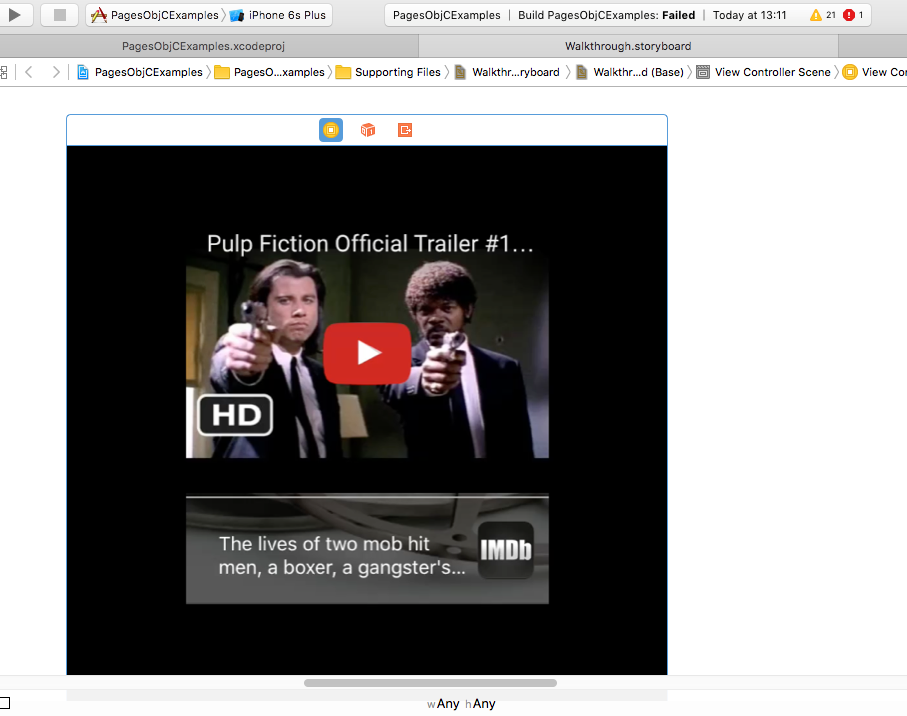
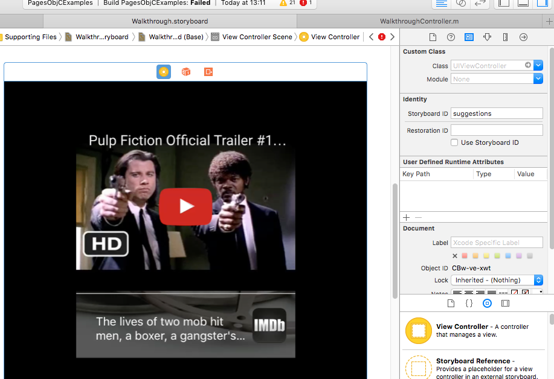

# Pages Controller iOS
[UIPages](http://cocoadocs.org/docsets/UIPages) is a wrapper framework for the [UIPageViewController](https://developer.apple.com/library/ios/documentation/UIKit/Reference/UIPageViewControllerClassReferenceClassRef/) UIKit class. Each Pages component is supplied through a [UIPagesDataSource](http://cocoadocs.org/docsets/UIPages/0.1.11/Classes/UIPagesDataSource.html) which is used to interact with the related storyboard. The UIPagesDataSource class allows us to cycle through the storyboard components, and it keeps up with its current index while cycling.

## Setup

### Installation

UIPages is available through [CocoaPods](http://cocoapods.org). To install
it, simply add the following line to your Podfile:

```ruby
pod "UIPages"
```

### Defining a Page

 

Add your controller onto the storyboard, then update the "Storyboard ID"

 

After updating the "Storyboard ID", you can then reference the controller in your UIPagesDataSource:

``` 
#import "WalkthroughController.h"

@interface WalkthroughController () <UIPagesDataSource>
@end

@implementation WalkthroughController
-(NSString*)getStoryboardName {
    return @"Walkthrough";
}
-(NSArray*)getIdentifiers {
    return @[@"suggestions"];
}
@end
``` 
After that implement a [UIPagesDataSource](http://cocoadocs.org/docsets/UIPages/0.1.11/Classes/UIPagesDataSource.html) can be defined in Swift as well:
```    
class WalkthroughController : UIPagesDataSource {
    func getStoryboardName() -> String {
        return "Walkthrough"
    }

    func getIdentifiers() -> [AnyObject] {
        return ["suggestions"]
    }
}
```

## Example Project
The PagesObjCExamples Project has 6 screens referenced by the Walkthrough Storyboard and Controller. To demonstrate how the swipes action will work on first launch of the application, this sample uses the [UISwipes](#) framework.

 

 

Above are two of the (six) Walkthrough screens, that display how an demonstration can be integrated into you app walkthrough.


To run the example project, clone the repo, and run `pod install` from the Example directory first.
```
git clone https://github.com/the-mac/pages-controller-ios.git
cd PagesObjCExamples
pod install
open PagesObjCExamples.xcworkspace
```
## Requirements
For your own project (and Podfile), our UIPages reference could look as follows:
```
platform :ios, '8.0'
target 'MyAppTarget' do
    pod 'UIPages'
end
```

## License

UIPages is available under the MIT license. See the LICENSE file for more info.